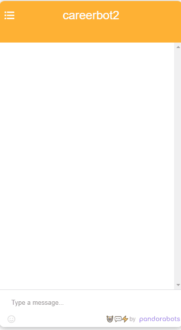

# Career Helper Bot

A Pandorabots application written AIM to help CS students decide on a career.

Submitted by: Joseph Lawter

Time spent: Four Hours

## User Stories

[X] Helps the user decide between 5 potential careers
[X] Gives a brief overview of what the career involves
[X] Provides instructions on how to navigate through the chat bot

## Video Walkthrough

Here's a walkthrough of implemented user stories:

## Notes

## License

Copyright 2021 Joseph Lawter
